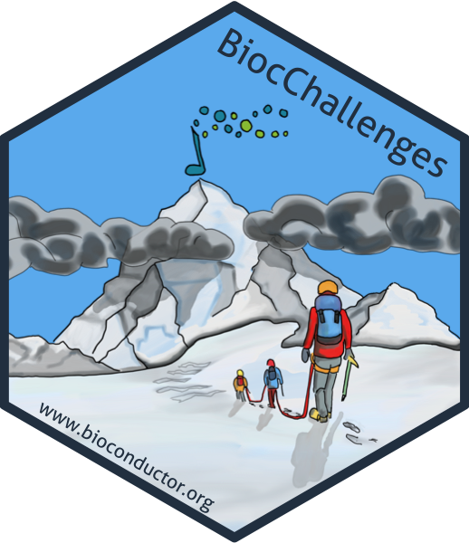
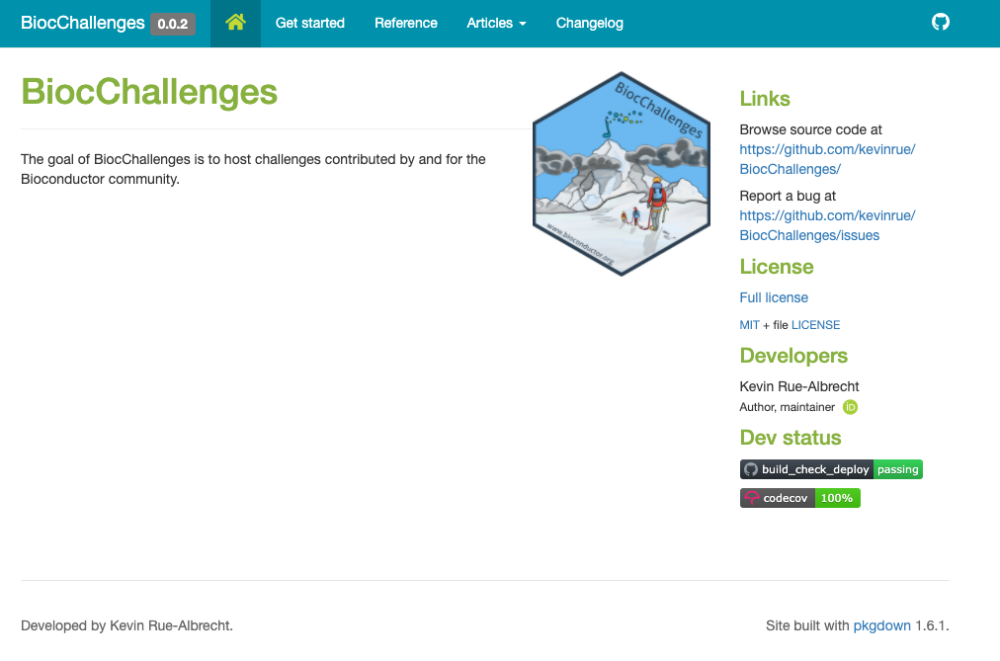
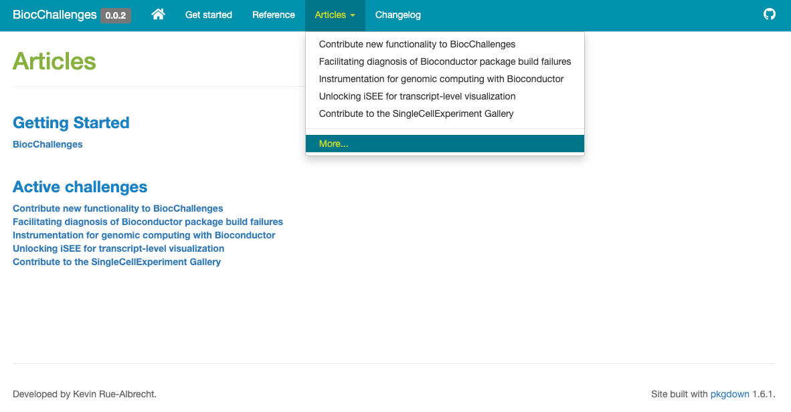
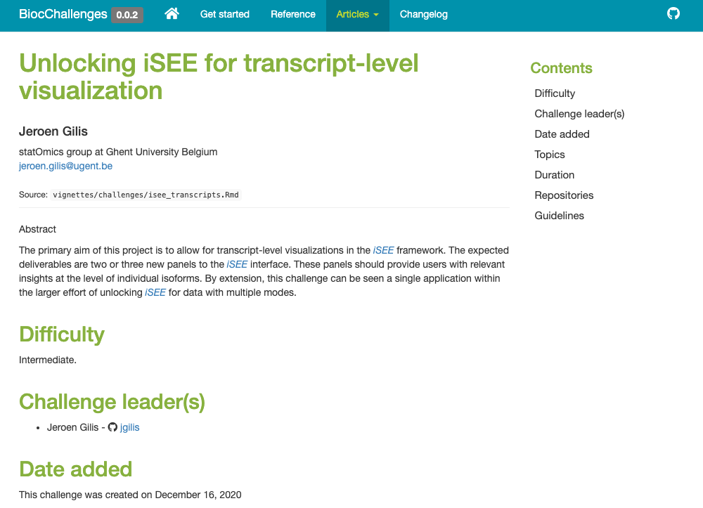
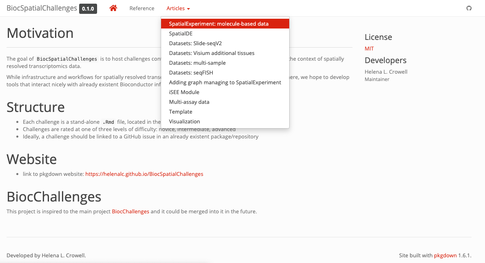
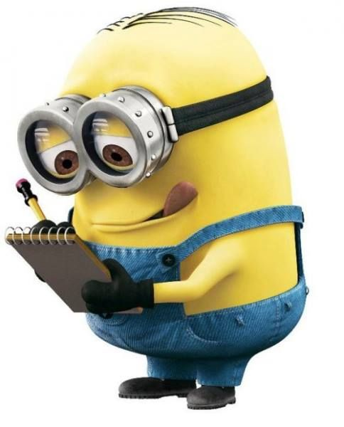
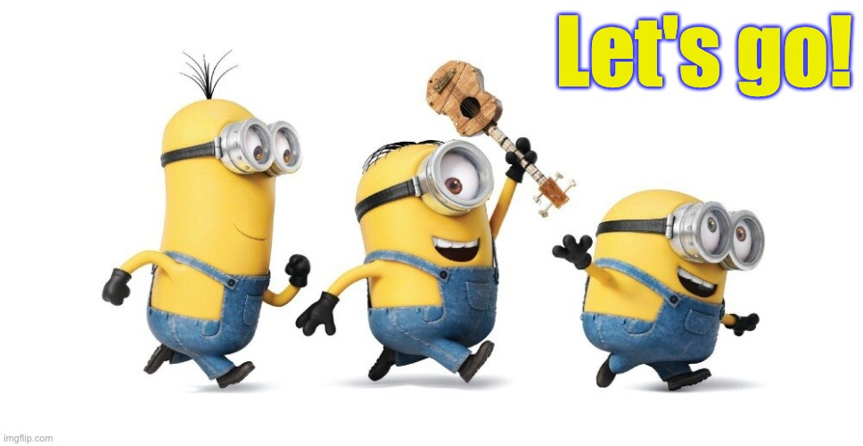

layout: true

<div class="my-header"></div>

<div class="my-footer"><span>
Kevin Rue-Albrecht
&emsp;&emsp;&emsp;&emsp;&emsp;&emsp;&emsp;&emsp;&emsp;&emsp;&emsp;&emsp;&emsp;
BiocChallenges
</span></div>

```{r setup, include=FALSE}
stopifnot(require(htmltools))
stopifnot(require(RefManageR))
stopifnot(require(knitr))
knitr::opts_chunk$set(echo = TRUE)
```

```{r htmltools, include=FALSE}
stopifnot(requireNamespace("htmltools"))
htmltools::tagList(rmarkdown::html_dependency_font_awesome())
```

```{r, load_refs, include=FALSE, cache=FALSE}
options(htmltools.dir.version = FALSE)
BibOptions(
  check.entries = FALSE,
  bib.style = "authoryear",
  cite.style = "authoryear",
  max.names = 2,
  style = "markdown",
  hyperlink = "to.doc",
  dashed = TRUE)
bib <- ReadBib("references.bib")
NoCite(bib, "orchestrating2015")
```

---

# Thank you!

.x-large-li[
.pull-left[
## People

- Mike Smith

- Charlotte Soneson

- Laurent Gatto

- Jeroen Gillis

- Michael Love

- Koen Van den Berge
]
]

.x-large-li[
.pull-left[
## Topics

- GitHub Action

- iSEE transcripts

- Spatial challenges
]
]

---

# A tour of BiocChallenges

.center[
<https://github.com/kevinrue/BiocChallenges>
]

```{r echo=FALSE, fig.align='center', out.height='450px', out.width='700px'}

```

---

# A tour of BiocChallenges

.center[
<https://github.com/kevinrue/BiocChallenges>
]

```{r echo=FALSE, fig.align='center', out.height='450px', out.width='1000px'}

```

---

# A tour of BiocChallenges

.center[
<https://github.com/kevinrue/BiocChallenges>
]

```{r echo=FALSE, fig.align='center', out.height='450px', out.width='700px'}

```

---

# Spatial challenges

.center[
<https://helenalc.github.io/BiocSpatialChallenges/>
]

```{r echo=FALSE, fig.align='center', out.height='450px', out.width='1000px'}

```

---

# Work in progress

.x-large-p[
.pull-left[
- Your feedback is welcome.

  + Challenge format.
  
  + Additional information for each challenge.
  
  + Additional functionality.
]
]

.pull-right[
```{r echo=FALSE, fig.align='center', out.height='100%'}

```
]


---

# What can you do this week? (and beyond!)

.pull-left[
## Ideas
<i class="fab fa-github"></i> Check out existing challenges at <https://kevinrue.github.io/BiocChallenges/>.

<i class="far fa-comments"></i> Network and communicate.

- On the conference platform<br/>
  (e.g., booth, lounge, chat).<br/>
  _Also available outside live sessions._

- On the Bioconductor Slack at <https://community-bioc.slack.com>.

<i class="fas fa-user-friends"></i> Get in touch with like-minded participants and speakers.
]

.pull-right[
## Actions

<i class="fab fa-github"></i> Submit a pull request to add a challenge at
<https://github.com/kevinrue/BiocChallenges/>

<i class="fab fa-github"></i> Contribute to an existing challenge repository.

<i class="fab fa-github"></i> Create new challenge repositories.

```{r echo=FALSE, fig.align='center'}

```
]

---

# At the end of this week

.x-large-p[
.center[
**Friday 19:05 - 19:15 (CET)**

**BiocChallenges closing presentation**
]

<br/>

Notify me throughout the week, so that I can report new challenges, ideas, and contributions!
]

---

# References

```{r refs, include=TRUE, echo=FALSE, results="asis"}
PrintBibliography(bib)
```

```{r echo=FALSE, fig.align='center'}
knitr::include_graphics("img/minions-job-done.jpg")
```
